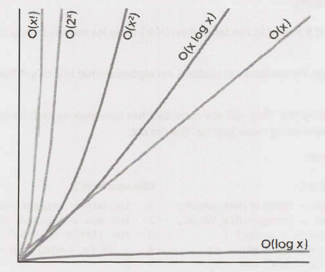
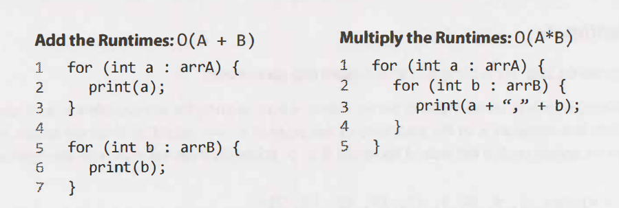
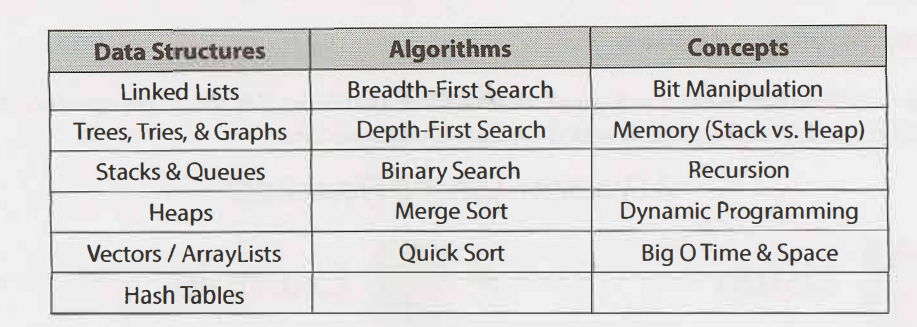
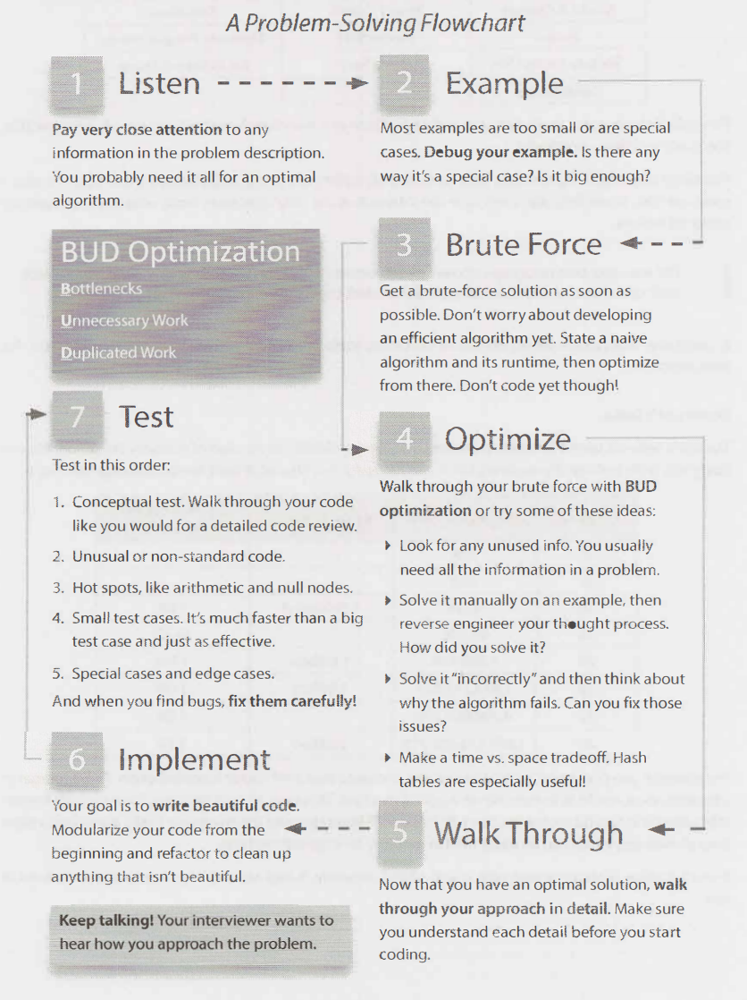

# Cracking the Code Interview

### Big O

* A way to determine efficiency of an algorithm, describes the rate of increase
* Example:
  * The runtime of electronic file transfer is O\(s\), where s is the size of a file, meaning the time increases linearly as the file increases
  * The runtime of airplane transfer is O\(1\), the time is constant, meaning that the time will be the same no matter the file size
* Time/Space forms \(see fig-1.png\):
  * O\(log n\)
  * O\(n log n\): Decreases by a fraction of 2
  * O\(n\): Increases linear to input size
  * O\(n^2\): Increaes by a multiple of 2
  * O\(2^n\)
* Drop constants, as time may different on the size of the inputs
* Drop non dominant terms, eg: N^2 + N becomes N&2
* Recursive runtime: @todo

#### Examples

@todo

### Technical Questions

* Practice solving coding problems on paper

**Problem Solving Approach**

* 1.Listen carefully
  * Most of the time information is there for a reason
  * Consider rewriting important information
  * Make sure you record any unique information
    * "Given two arrays that are sorted...": Why are they sorted?
    * "Design an algorithm to be run repeatly on a server...": What would they be looking for? Caching?
  * If you're stuck, asking yourself if you've used all the information
* 2. Draw an example
  * Always draw an example, it will give you more insight than working it out inside your head
  * Example should be:
    * Specific: Use real values
    * Sufficiently large: Use a large amount of values
    * Not a special case
* 3. State a brute force
  * @todo
* 4. Optimise
  * Look for unused information, can you leverage it?
  * Solve it incorrectly and work from there
  * Make space/time runtime trade off, eg: storing extra program state
  * Can you pre-compute the values?
  * Can you use a hash table? These are used frequently
* 5. Walk Through
  * It will be easier to make sure your solution is "correct" before you start coding
  * Will help you get a feel for the structure of the code
* 6. Implement
* 7. Test

#### Optimise & Solve Techniques

* BUD: Continuously find and remove bottlenecks, useless work, duplicate work
  * Bottlenecks:

