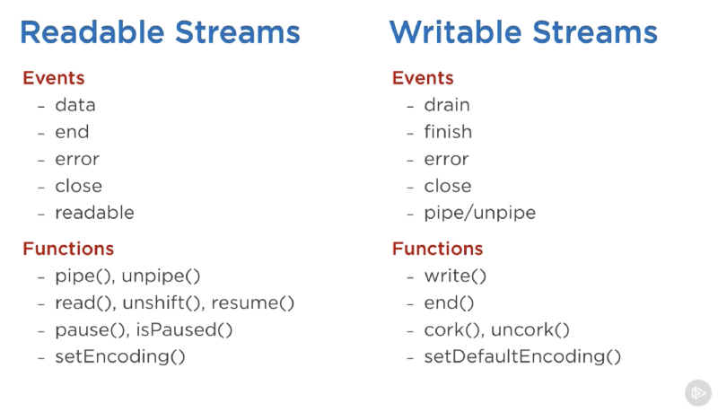

# Streams

* **Provide ability to scale IO**
* Streams can work on data one chunk at a time
  * Great for **large files that can't fit into memory**
  * Need to send/receive large amounts of data over the network
  * Send a fast partial response
* Types
  * Readable
  * Writable
  * Duplex \(Readable + Writable\)
  * Transform: Placed between a readable and writable stream to transform data between
* Use `pipe` to consume streams
  * `sourceReadable.pipe(destinationWritable)`
* Streams can consume events \(see examples\)
  * Read
    * `event.data` Stream is passed a chunk of data
    * `event.end` Stream has finished consumption
  * Write
    * `event.drain` Stream can receive more data
    * `event.finish` Stream has flushed all data to system




### Examples

```javascript
// Consume stream events.

readable.on('data', (chunk) => {
  writable.write(chunk);
});

readable.on('end', () => {
  writable.end();
});
```

```javascript
// Create a writable stream.

const { Writable } = require('stream');

const outStream = new Writable({
  // Implement write method, what to do when a chunk
  // is received. `chunk` is the data stream chunk,
  // `callback` to signify a chunk is done reading,
  // can pass an error object to signify error.
  write(chunk, encoding, callback) {
    console.log(chunk.toString());
    callback();
  }
});

process.stdin.pipe(outStream);
```

```javascript
// Create a readable stream.
const { Readable } = require('stream'); 

const inStream = new Readable({
  read() {}
});

// Push data to stream.
inStream.push('ABCDEFGHIJKLM');
inStream.push('NOPQRSTUVWXYZ');

// Signal end of data.
inStream.push(null);

// Pipe data out to stream.
inStream.pipe(process.stdout);
```

```javascript
// Send alphabet from RS to WS.

const { Readable } = require("stream")

let char = 'a'.charCodeAt(0) - 1

// Create readable stream.
const rs = new Readable({
  read() {
    // Signal end when `z` char has been reached.
    if (char >= 'z'.charCodeAt(0)) return rs.push(null)

    setTimeout(() => {
      // Push data to stream.
      rs.push(String.fromCharCode(++char))
    }, 100)
  }
})

// Pipe stream to stdout (writable stream).
rs.pipe(process.stdout)

process.on("exit", () => {
  console.log("Done")
})

// Watch `error` event on stdout (writable stream).
process.stdout.on("error", process.exit)

```

### Reading

* https://github.com/substack/stream-handbook 

